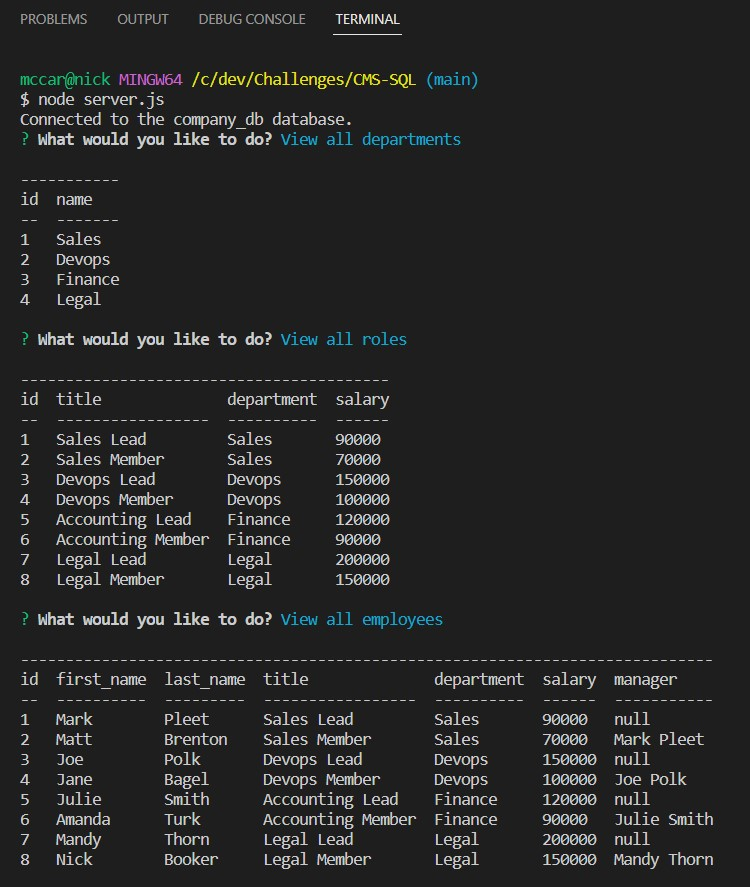

# Employee Tracker 
 ## Description 
  
 ## Table Of Contents 
 - [Title](#title) 
 - [Description](#description) 
 - [Installation](#installation) 
 - [Usage](#usage) 
 - [License](#license) 
 - [Contributing](#contributing) 
 - [Test](#test) 
 - [Questions](#questions) 
 ## Installation 
 requires node, inquirer 8.2.4, and mysql2
 ## Usage 
 run from cli
 caption: example of terminal commands
 

 

 ## License 
 MIT License 
  
 ## Contributing 
 Michael Smith
  
 Github: https://github.com/AustinBQ02
  
 Rebecca Girndt
  
 GitHub: https://github.com/Re-Gi
  
 ## Test 
 NA 
 ## Questions 
 UserName: Nick-McCarthy 
 https://github.com/Nick-McCarthy
